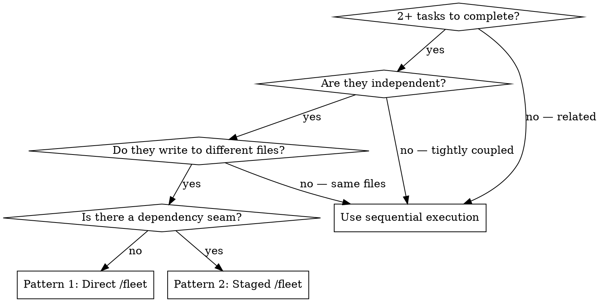

# superpowers-copilot Implementation Plan

> **For agentic workers:** REQUIRED: Use superpowers:subagent-driven-development (if subagents available) or superpowers:executing-plans to implement this plan. Steps use checkbox (`- [ ]`) syntax for tracking.

**Goal:** Adapt the superpowers-stanvx repo into a distributable `superpowers-copilot` Copilot CLI plugin by creating 3 new files, modifying 7 existing files, and establishing `/fleet`-native patterns throughout.

**Architecture:** Layered fork — a thin tool-mapping reference covers the 12 unchanged skills implicitly; three high-leverage skills (`dispatching-parallel-agents`, `subagent-driven-development`, `using-superpowers`) get deeper Copilot CLI-native rewrites. New cross-skill reference files (`copilot-cli-tools.md`, `copilot-workflow.md`) centralize the adaptation layer.

**Spec:** `docs/superpowers/specs/2026-03-15-superpowers-copilot-design.md`

---

## File Map

| File | Action | Responsibility |
|---|---|---|
| `plugin.json` | CREATE | Copilot CLI plugin manifest |
| `AGENTS.md` | CREATE | Auto-loaded session bootstrap instruction |
| `skills/using-superpowers/references/copilot-cli-tools.md` | CREATE | Tool name mapping (TodoWrite→sql, WebSearch→web_search, WebFetch→web_fetch) |
| `skills/using-superpowers/references/copilot-workflow.md` | CREATE | /fleet patterns, /research integration, request-efficiency principles |
| `skills/using-superpowers/SKILL.md` | MODIFY | Add "In Copilot CLI" subsection + update Platform Adaptation |
| `skills/dispatching-parallel-agents/SKILL.md` | MODIFY (deep rewrite) | Replace Task() patterns with /fleet Patterns 1 and 2 |
| `skills/subagent-driven-development/SKILL.md` | MODIFY | TodoWrite→sql, code-quality-reviewer is final gate (not re-looped), request-efficiency note |
| `hooks/hooks.json` | NO CHANGE | Verified: COPILOT_PLUGIN_ROOT does not exist in Copilot CLI. Changing CLAUDE_PLUGIN_ROOT would break Claude Code. Copilot CLI uses .github/hooks/ format instead. |
| `.github/hooks/session-start.json` | CREATE | Copilot CLI native hook format (version:1, sessionStart, bash/powershell) |
| `hooks/session-start` | MODIFY | Add Copilot CLI detection branch |
| `README.md` | MODIFY | Add Copilot CLI install section |

`hooks/run-hook.cmd` — **no changes needed** (uses self-relative `HOOK_DIR=%~dp0`/`SCRIPT_DIR`, not the plugin root env var).

---

## Chunk 1: Foundation Files

Tasks 1–5: new manifest files, new reference docs, and the `using-superpowers` SKILL.md update.

---

### Task 1: Create `plugin.json`

**Files:**
- Create: `plugin.json`

- [ ] **Step 1: Create the file**

Create `plugin.json` at the repo root with this exact content:

```json
{
  "name": "superpowers-copilot",
  "description": "Complete dev workflow for Copilot CLI: TDD, /fleet-native parallel agents, subagent handoffs, debugging, and more",
  "version": "1.0.0",
  "author": { "name": "Trent Stanton" },
  "homepage": "https://github.com/trentstanton/superpowers-copilot",
  "license": "MIT",
  "keywords": ["skills", "tdd", "fleet", "subagents", "debugging", "workflows"]
}
```

- [ ] **Step 2: Verify**

Run: `cat plugin.json | python3 -m json.tool`
Expected: valid JSON printed with no errors.

- [ ] **Step 3: Commit**

```bash
git add plugin.json
git commit -m "feat: add plugin.json Copilot CLI manifest

Co-authored-by: Copilot <223556219+Copilot@users.noreply.github.com>"
```

---

### Task 2: Create `AGENTS.md`

**Files:**
- Create: `AGENTS.md`

- [ ] **Step 1: Create the file**

Create `AGENTS.md` at the repo root with this exact content:

```markdown
# superpowers-copilot

This repo uses the superpowers-copilot plugin. Immediately invoke the `using-superpowers` skill before any response or action.
```

The single instruction is intentionally minimal — it's the safety net for programmatic sessions where the session-start hook may not fire. The skill itself contains all further guidance.

- [ ] **Step 2: Verify**

Run: `cat AGENTS.md`
Expected: content matches exactly as written above.

- [ ] **Step 3: Commit**

```bash
git add AGENTS.md
git commit -m "feat: add AGENTS.md auto-loaded session bootstrap

Co-authored-by: Copilot <223556219+Copilot@users.noreply.github.com>"
```

---

### Task 3: Create `skills/using-superpowers/references/copilot-cli-tools.md`

**Files:**
- Create: `skills/using-superpowers/references/copilot-cli-tools.md`

This is the tool name mapping reference. It's loaded via `@` citation in `using-superpowers/SKILL.md` so all other skills implicitly benefit.

- [ ] **Step 1: Create the file**

```markdown
# Copilot CLI Tool Name Mapping

Copilot CLI tool names are nearly identical to Claude Code. Three diverge:

| Skill/prompt references this | Copilot CLI tool to use |
|---|---|
| `Skill` | `skill` (same) |
| `Task` (subagent dispatch) | `task` (same) |
| `Read` / `view` / read a file | `view` (same) |
| `Write` / `create` a file | `create` (same) |
| `Edit` | `edit` (same) |
| `Bash` | `bash` (same) |
| `Grep` | `grep` (same) |
| `Glob` | `glob` (same) |
| `TodoWrite` | `sql` — use the session database (`database: "session"`) |
| `WebSearch` | `web_search` |
| `WebFetch` | `web_fetch` |

## Using `sql` instead of `TodoWrite`

`TodoWrite` in Claude Code writes to a managed todo list. In Copilot CLI, use the `sql` tool against the built-in `todos` table:

```sql
-- Create todos
INSERT INTO todos (id, title, description) VALUES
  ('task-1', 'Title here', 'Full description with context');

-- Mark complete
UPDATE todos SET status = 'done' WHERE id = 'task-1';

-- Query what is ready (no pending dependencies)
SELECT t.* FROM todos t
WHERE t.status = 'pending'
AND NOT EXISTS (
    SELECT 1 FROM todo_deps td
    JOIN todos dep ON td.depends_on = dep.id
    WHERE td.todo_id = t.id AND dep.status != 'done'
);
```

The `todos` table is pre-created. Columns: `id TEXT`, `title TEXT`, `description TEXT`, `status TEXT` (pending/in_progress/done/blocked), `created_at`, `updated_at`.
```

- [ ] **Step 2: Verify**

Run: `cat skills/using-superpowers/references/copilot-cli-tools.md | head -5`
Expected: `# Copilot CLI Tool Name Mapping`

- [ ] **Step 3: Commit**

```bash
git add skills/using-superpowers/references/copilot-cli-tools.md
git commit -m "feat: add copilot-cli-tools.md tool name mapping reference

Co-authored-by: Copilot <223556219+Copilot@users.noreply.github.com>"
```

---

### Task 4: Create `skills/using-superpowers/references/copilot-workflow.md`

**Files:**
- Create: `skills/using-superpowers/references/copilot-workflow.md`

This cross-skill reference covers three topics: request efficiency, `/research` integration, and a `/fleet` quick-reference. Any skill can cite it with `@`.

- [ ] **Step 1: Create the file**

```markdown
# Copilot CLI Workflow Patterns

## Request Efficiency

Copilot CLI bills per user message (request), not per token. Design interactions to minimize round-trips:

- **Batch clarifying questions up front.** Ask everything you need to know in one message rather than one question at a time.
- **Pass context generously into subagent `task` calls.** Include the full plan section, relevant file contents, and error messages in the initial dispatch. A subagent that needs to ask for clarification costs an extra request.
- **Use `/compact` reactively, not proactively.** Compact only when approaching context limits, not as a routine step.
- **Prefer depth in one response over back-and-forth.** A thorough first answer is cheaper than a dialogue.

## `/research` Integration

When `brainstorming` is invoked on a topic where deep background would improve the design, offer a `/research` pre-flight:

> *"Would a `/research` report on [TOPIC] help before we design? I can run it now and reference the findings when forming questions."*

This is **opt-in only** — never trigger `/research` automatically.

If the user accepts:
1. Run `/research TOPIC`
2. Reference the findings in the clarifying questions and design sections
3. Cite the report when presenting the design: *"Based on the `/research` findings: ..."*

The `/research` command uses a hard-coded model (Claude Sonnet 4.5) and is not affected by `/model` selection. It produces a saved Markdown report in `~/.copilot/session-state/<session-id>/research/`.

## `/fleet` Quick-Reference

`/fleet` dispatches multiple agents in parallel. Each agent gets its own context window.

**Basic syntax:**
```
/fleet [brief description] — Agent 1: [task with full context]. Agent 2: [task with full context].
```

**When to use:**
- 2+ tasks that write to different files and have no dependency between them
- Research across unrelated domains

**When NOT to use:**
- Tasks write to the same files (agents conflict)
- You need one result before knowing the next task
- Fewer than 2 independent domains

For full `/fleet` patterns including staged dispatch and agent prompt guidelines, invoke `superpowers:dispatching-parallel-agents`.
```

- [ ] **Step 2: Verify**

Run: `cat skills/using-superpowers/references/copilot-workflow.md | head -5`
Expected: `# Copilot CLI Workflow Patterns`

- [ ] **Step 3: Commit**

```bash
git add skills/using-superpowers/references/copilot-workflow.md
git commit -m "feat: add copilot-workflow.md cross-skill reference

Co-authored-by: Copilot <223556219+Copilot@users.noreply.github.com>"
```

---

### Task 5: Update `skills/using-superpowers/SKILL.md`

**Files:**
- Modify: `skills/using-superpowers/SKILL.md`

Two targeted changes:
1. Add an "In Copilot CLI" entry to the "How to Access Skills" section
2. Update the "Platform Adaptation" paragraph to mention Copilot CLI

- [ ] **Step 1: View the target section**

Run: `sed -n '28,42p' skills/using-superpowers/SKILL.md`

You should see:
```
**In Claude Code:** Use the `Skill` tool. ...
**In Gemini CLI:** Skills activate via the `activate_skill` tool. ...
**In other environments:** Check your platform's documentation for how skills are loaded.
## Platform Adaptation
Skills use Claude Code tool names. Non-CC platforms: see `references/codex-tools.md` (Codex) ...
```

- [ ] **Step 2: Insert "In Copilot CLI" entry**

In the "How to Access Skills" section, insert the following BEFORE the `**In other environments:**` line:

```
**In Copilot CLI:** Use the `skill` tool. Load `@skills/using-superpowers/references/copilot-cli-tools.md` for the tool name mapping and `@skills/using-superpowers/references/copilot-workflow.md` for `/fleet`, `/research`, and request-efficiency guidance.
```

Use the `edit` tool. The `old_str` should be:
```
**In other environments:** Check your platform's documentation for how skills are loaded.
```

The `new_str` should be:
```
**In Copilot CLI:** Use the `skill` tool. Load `@skills/using-superpowers/references/copilot-cli-tools.md` for the tool name mapping and `@skills/using-superpowers/references/copilot-workflow.md` for `/fleet`, `/research`, and request-efficiency guidance.

**In other environments:** Check your platform's documentation for how skills are loaded.
```

- [ ] **Step 3: Update Platform Adaptation paragraph**

The current paragraph reads (approximately):
```
Skills use Claude Code tool names. Non-CC platforms: see `references/codex-tools.md` (Codex) for tool equivalents. Gemini CLI users get the tool mapping loaded automatically via GEMINI.md.
```

Replace with:
```
Skills use Claude Code tool names. Platform-specific tool mappings: see `references/codex-tools.md` (Codex) or `references/copilot-cli-tools.md` (Copilot CLI) for equivalents. Gemini CLI users get the tool mapping loaded automatically via GEMINI.md. Copilot CLI users load the mapping explicitly via the `using-superpowers` skill.
```

Use the `edit` tool to make this change.

- [ ] **Step 4: Verify**

Run: `grep -n "Copilot CLI" skills/using-superpowers/SKILL.md`
Expected: 2+ matches — one in "How to Access Skills", one in "Platform Adaptation".

- [ ] **Step 5: Commit**

```bash
git add skills/using-superpowers/SKILL.md
git commit -m "feat: add Copilot CLI section to using-superpowers SKILL.md

Co-authored-by: Copilot <223556219+Copilot@users.noreply.github.com>"
```

---

## Chunk 2: Core Skill Rewrites

Tasks 6–7: deep rewrite of `dispatching-parallel-agents` around `/fleet`, and targeted updates to `subagent-driven-development`.

---

### Task 6: Rewrite `skills/dispatching-parallel-agents/SKILL.md`

**Files:**
- Modify: `skills/dispatching-parallel-agents/SKILL.md` (182 lines → ~160 lines)

Full replacement. The `Task()` dispatch pattern is replaced with `/fleet` as the native primitive. Two patterns are established: direct `/fleet` and staged fleet with handoff.

- [ ] **Step 1: View the current file**

Run: `cat skills/dispatching-parallel-agents/SKILL.md`

Read the full output. The file is 182 lines. You'll need its entire content as the `old_str` for the replacement in Step 2.

- [ ] **Step 2: Replace the file contents entirely**

Replace the ENTIRE file content with:

```markdown
---
name: dispatching-parallel-agents
description: Use when facing 2+ independent tasks that can be worked on without shared state or sequential dependencies
---

# Dispatching Parallel Agents

## Overview

You dispatch independent tasks to fleet agents running in parallel. Each agent has its own context window and works concurrently. The main agent reviews and integrates results.

**In Copilot CLI: use `/fleet` as the dispatch primitive.** Prefix your prompt with `/fleet` and describe each agent's task in a single message.

**Core principle:** One problem domain per agent. No shared state. Let them work concurrently.

## When to Use



**Use when:**
- 3+ test files failing with different root causes
- Multiple subsystems broken independently
- Research and exploration across unrelated domains
- Each problem can be understood without context from others
- No shared state between tasks (different files, different concerns)

**Don't use when:**
- Tasks write to the same files (agents would conflict)
- You need to see one result before knowing the next task
- Tasks are related (fixing one might fix others)
- Fewer than 2 independent domains (sequential is simpler)

## Pattern 1 — Direct `/fleet` Dispatch

Use for 2–4 independent tasks with no dependency between them.

**Syntax:**
```
/fleet [BRIEF DESCRIPTION] — Agent 1: [task 1 with full context]. Agent 2: [task 2 with full context]. Agent 3: [task 3 with full context].
```

**Example:**
```
/fleet Fix 3 failing test files — Agent 1: fix agent-tool-abort.test.ts — 3 timing/race condition failures, see error output: [paste errors]. Agent 2: fix batch-completion.test.ts — 2 failures, event structure mismatch, see: [paste errors]. Agent 3: fix race-conditions.test.ts — 1 failure, async wait missing, see: [paste errors].
```

Each agent works in its own context window. After all complete:
1. Read each agent's summary
2. Check for conflicts (did any agents edit the same files?)
3. Run the full test suite / verify combined output
4. Integrate any cross-agent concerns

## Pattern 2 — Staged `/fleet` with Handoff

Use when tasks form two waves: an independent first set whose outputs feed a second set.

**Example — research then implement:**
```
Stage 1:
/fleet Research two subsystems — Agent 1: research how the auth system works in src/auth/. Return key findings. Agent 2: research how the session system works in src/sessions/. Return key findings.

[Wait for Stage 1 results]

Stage 2:
/fleet Implement changes using Stage 1 findings — Agent 1: add JWT refresh to auth/ using these findings: [paste Agent 1 findings]. Agent 2: add session invalidation to sessions/ using: [paste Agent 2 findings].
```

The key: Stage 2 prompt includes the actual output from Stage 1. Do not start Stage 2 until all Stage 1 agents have returned.

## Writing Good Agent Prompts

Each agent in a `/fleet` call needs:
1. **Specific scope** — one test file, one subsystem, one concern
2. **Full context** — paste error messages, relevant code snippets, and task description directly
3. **Clear constraints** — "Do NOT change files outside src/auth/"
4. **Expected output format** — "Return: root cause, files changed, any concerns"

**❌ Bad (too vague):**
```
/fleet Fix all the tests — Agent 1: fix auth tests. Agent 2: fix session tests.
```

**✅ Good (specific with context):**
```
/fleet Fix 2 test files — Agent 1: fix src/auth/auth.test.ts — 2 failures: "token not refreshed" (line 45) and "session not invalidated" (line 89). Do NOT change production code. Return: root cause and what you changed. Agent 2: fix src/sessions/session.test.ts — 1 failure: "session.get() returns null after login" (line 23). Suspect src/sessions/store.ts:67. Return: root cause and fix.
```

## After Fleet Agents Return

1. **Read each summary** — understand what changed and what was found
2. **Check for conflicts** — did any agents touch the same files?
3. **Verify integration** — run the full test suite or verify combined output
4. **Spot-check critical changes** — review high-risk changes directly

## Common Mistakes

**❌ Shared state:** Agent 1 edits `config.ts` and Agent 2 also edits `config.ts` → conflict  
**✅ Isolate:** Break into sequential tasks if they share files

**❌ No context:** "Fix the race condition" → agent doesn't know where  
**✅ Context:** Paste the error, the test name, the file path

**❌ Vague output:** "Fix it" → you don't know what changed  
**✅ Specific:** "Return: root cause, files changed, what you fixed"

**❌ Dependent tasks in one fleet call:** Agent 2 needs Agent 1's output  
**✅ Staged:** Use Pattern 2 — wait for Stage 1 before dispatching Stage 2

## Real Example

**Scenario:** 6 test failures across 3 files after a major refactoring

**Fleet call:**
```
/fleet Fix 3 test files — Agent 1: fix agent-tool-abort.test.ts (3 timing failures, errors: [paste]). Agent 2: fix batch-completion-behavior.test.ts (2 failures, event structure errors: [paste]). Agent 3: fix tool-approval-race-conditions.test.ts (1 failure, async count: [paste]).
```

**Results:**
- Agent 1: Replaced timeouts with event-based waiting
- Agent 2: Fixed event structure bug (threadId in wrong location)
- Agent 3: Added wait for async tool execution to complete

**Integration:** All fixes independent, no conflicts, full suite green
```

- [ ] **Step 2: Verify**

Run: `grep -n "fleet\|Pattern" skills/dispatching-parallel-agents/SKILL.md`
Expected: multiple matches for `/fleet`, "Pattern 1", "Pattern 2".

Run: `grep -c "Task()" skills/dispatching-parallel-agents/SKILL.md`
Expected: 0 (no remaining Task() references).

- [ ] **Step 3: Commit**

```bash
git add skills/dispatching-parallel-agents/SKILL.md
git commit -m "feat: rewrite dispatching-parallel-agents around /fleet patterns

Co-authored-by: Copilot <223556219+Copilot@users.noreply.github.com>"
```

---

### Task 7: Update `skills/subagent-driven-development/SKILL.md`

**Files:**
- Modify: `skills/subagent-driven-development/SKILL.md`

Three targeted changes:
1. `TodoWrite` references → `sql todos table` (6 occurrences: 2 node definitions, 2 edge sources/targets, 1 edge label, 1 prose example)
2. Code-quality-reviewer loop: remove the re-loop edge; replace with "surface to human if blocked"
3. Add a request-efficiency note in a new "## In Copilot CLI" section

- [ ] **Step 1: Verify all TodoWrite occurrences**

Run: `grep -n "TodoWrite" skills/subagent-driven-development/SKILL.md`
Expected: 6 matches across flowchart node definitions, edge declarations, and prose.

- [ ] **Step 2: Edit 1 — rename the node definition**

Replace:
```
        "Mark task complete in TodoWrite" [shape=box];
```
With:
```
        "Mark task complete in sql todos table" [shape=box];
```

- [ ] **Step 3: Edit 2 — rename the "Read plan" node definition**

Replace:
```
    "Read plan, extract all tasks with full text, note context, create TodoWrite" [shape=box];
```
With:
```
    "Read plan, extract all tasks with full text, note context, create sql todos table" [shape=box];
```

- [ ] **Step 4: Edit 3 — rename the "Read plan" edge source**

Replace:
```
    "Read plan, extract all tasks with full text, note context, create TodoWrite" -> "Dispatch implementer subagent (./implementer-prompt.md)";
```
With:
```
    "Read plan, extract all tasks with full text, note context, create sql todos table" -> "Dispatch implementer subagent (./implementer-prompt.md)";
```

- [ ] **Step 5: Edit 4 — fix code-quality-reviewer de-loop AND rename edge targets**

The code-quality-reviewer must be the **final gate** (not re-looped). Surface to human if blocked.

Find this four-line block:
```
    "Code quality reviewer subagent approves?" -> "Implementer subagent fixes quality issues" [label="no"];
    "Implementer subagent fixes quality issues" -> "Dispatch code quality reviewer subagent (./code-quality-reviewer-prompt.md)" [label="re-review"];
    "Code quality reviewer subagent approves?" -> "Mark task complete in TodoWrite" [label="yes"];
    "Mark task complete in TodoWrite" -> "More tasks remain?";
```
Replace with:
```
    "Code quality reviewer subagent approves?" -> "Surface to human: quality issues list" [label="no — blocked"];
    "Code quality reviewer subagent approves?" -> "Mark task complete in sql todos table" [label="yes"];
    "Mark task complete in sql todos table" -> "More tasks remain?";
```

- [ ] **Step 6: Edit 5 — update the node definition for quality issues**

Find:
```
        "Implementer subagent fixes quality issues" [shape=box];
```
Replace with:
```
        "Surface to human: quality issues list" [shape=box style=filled fillcolor=lightyellow];
```

- [ ] **Step 7: Edit 6 — update the prose example**

Find:
```
[Create TodoWrite with all tasks]
```
Replace with:
```
[Create sql todos table with all tasks]
```

- [ ] **Step 8: Add "## In Copilot CLI" section**

Find the end of the frontmatter section (the last `---` before `# Subagent-Driven Development`) and the `## Overview` heading. Add a new section AFTER the last heading before the flowchart (e.g., after `## When to Use` or `## Overview`).

Find a suitable insertion point by running: `grep -n "^## " skills/subagent-driven-development/SKILL.md`

Add this section before `## The Workflow` (or equivalent heading near the top):

```markdown
## In Copilot CLI

- **Task tracking:** Use `sql` instead of `TodoWrite`. The `todos` table is pre-created. See `@skills/using-superpowers/references/copilot-cli-tools.md` for the full mapping.
- **Request efficiency:** Each `task` call is one request. Pass context generously in the initial dispatch — include the full plan section, relevant file contents, and error messages. A subagent that needs to ask back for context costs an extra round-trip.
- **Subagent dispatch:** Use the `task` tool (same name as Claude Code). Pass `mode: "background"` for tasks that take more than a few seconds.
```

- [ ] **Step 9: Verify**

Run: `grep -n "TodoWrite" skills/subagent-driven-development/SKILL.md`
Expected: 0 matches.

Run: `grep -n "sql todos table\|re-review\|Surface to human" skills/subagent-driven-development/SKILL.md`
Expected: `sql todos table` appears 6 times; `re-review` appears 1 time (the spec-reviewer loop only); `Surface to human` appears 1 time.

- [ ] **Step 10: Commit**

```bash
git add skills/subagent-driven-development/SKILL.md
git commit -m "feat: update subagent-driven-development for Copilot CLI

- TodoWrite → sql todos table
- Code-quality-reviewer is final gate (no re-loop)
- Add In Copilot CLI section with request-efficiency guidance

Co-authored-by: Copilot <223556219+Copilot@users.noreply.github.com>"
```

---

## Chunk 3: Infrastructure

Tasks 8–9: hooks wiring (with verification step) and README update.

---

### Task 8: Update `hooks/hooks.json` and `hooks/session-start`

**Files:**
- Modify: `hooks/hooks.json`
- Modify: `hooks/session-start`

⚠️ **VERIFY FIRST before writing code.** The Copilot CLI hook execution environment must be checked to confirm:
1. What env var Copilot CLI sets to the plugin root (expected: `COPILOT_PLUGIN_ROOT`)
2. What JSON format Copilot CLI expects from hook output (`hookSpecificOutput` or `additional_context`)

**Note on `hooks/run-hook.cmd`:** The spec (Component 9) mentions `run-hook.cmd` is "in scope for a one-line path variable update (same change as hooks.json)." After inspecting the file, **no change is needed** — `run-hook.cmd` uses self-relative paths (`HOOK_DIR=%~dp0` on Windows, `SCRIPT_DIR="$(cd "$(dirname "$0")" && pwd)"` on Unix) and does not reference `CLAUDE_PLUGIN_ROOT` at all. The spec's assumption was incorrect. `run-hook.cmd` is confirmed out of scope.

- [x] **Step 1: Verify Copilot CLI hook env var and output format**

**Step 1 findings (verified 2026-03-15):**
- Copilot CLI does NOT use `COPILOT_PLUGIN_ROOT`. No plugin root env var documented.
- Copilot CLI hook format: `version:1`, `sessionStart` (camelCase), `bash`/`powershell` fields, `cwd`, `timeoutSec`
- Hooks live in `.github/hooks/*.json`, not `hooks/hooks.json` (Claude Code format)
- Output format for context injection: not documented; AGENTS.md is the confirmed primary fallback
- **Decision**: Create `.github/hooks/session-start.json` (Copilot CLI format). Do NOT modify `hooks/hooks.json` (would break Claude Code).
- **Escape hatch applied**: Per plan Notes section — "Success criterion 5b explicitly accommodates this."

Fetch the Copilot CLI hooks documentation:
Use `web_fetch` with URL: `https://docs.github.com/en/copilot/concepts/agents/coding-agent/about-hooks`

Look for:
- The plugin root env var name (look for `COPILOT_PLUGIN_ROOT` or similar)
- The expected hook output JSON format (look for `additional_context` or `hookSpecificOutput`)

**Document your findings as a comment before proceeding.** Write down:
- Confirmed env var name: `COPILOT_PLUGIN_ROOT` (or whatever the docs say)
- Confirmed output format: `additional_context` or `hookSpecificOutput`

If the docs are silent on the env var, add a fallback step: run `env | grep -i copilot` inside a live hook execution to discover the actual variable name.

⚠️ **If the env var name differs from `COPILOT_PLUGIN_ROOT`**, you must substitute the correct name in **all three places** in this task: (a) hooks.json in Step 2, (b) the `elif` condition in session-start in Step 3, and (c) the commit message. Use search-and-replace to catch all instances.

- [ ] **Step 2: Update `hooks/hooks.json`**

Current content:
```json
{
  "hooks": {
    "SessionStart": [
      {
        "matcher": "startup|resume|clear|compact",
        "hooks": [
          {
            "type": "command",
            "command": "\"${CLAUDE_PLUGIN_ROOT}/hooks/run-hook.cmd\" session-start",
            "async": false
          }
        ]
      }
    ]
  }
}
```

Replace `${CLAUDE_PLUGIN_ROOT}` with `${COPILOT_PLUGIN_ROOT}` (or the verified env var name):

```json
{
  "hooks": {
    "SessionStart": [
      {
        "matcher": "startup|resume|clear|compact",
        "hooks": [
          {
            "type": "command",
            "command": "\"${COPILOT_PLUGIN_ROOT}/hooks/run-hook.cmd\" session-start",
            "async": false
          }
        ]
      }
    ]
  }
}
```

Verify: `cat hooks/hooks.json | python3 -m json.tool`
Expected: valid JSON, contains `COPILOT_PLUGIN_ROOT`.

- [ ] **Step 3: Add Copilot CLI branch to `hooks/session-start`**

The current output section is:
```bash
if [ -n "${CLAUDE_PLUGIN_ROOT:-}" ]; then
  # Claude Code sets CLAUDE_PLUGIN_ROOT — emit only hookSpecificOutput
  cat <<EOF
{
  "hookSpecificOutput": {
    "hookEventName": "SessionStart",
    "additionalContext": "${session_context}"
  }
}
EOF
else
  # Other platforms (Cursor, etc.) — emit only additional_context
  cat <<EOF
{
  "additional_context": "${session_context}"
}
EOF
fi
```

Add a Copilot CLI detection branch using the verified env var and output format. If Copilot CLI uses the same `additional_context` format as Cursor:

```bash
if [ -n "${CLAUDE_PLUGIN_ROOT:-}" ]; then
  # Claude Code sets CLAUDE_PLUGIN_ROOT — emit only hookSpecificOutput
  cat <<EOF
{
  "hookSpecificOutput": {
    "hookEventName": "SessionStart",
    "additionalContext": "${session_context}"
  }
}
EOF
elif [ -n "${COPILOT_PLUGIN_ROOT:-}" ]; then
  # Copilot CLI — emit additional_context (adjust format if docs say otherwise)
  # NOTE: Update COPILOT_PLUGIN_ROOT here if Step 1 found a different env var name
  cat <<EOF
{
  "additional_context": "${session_context}"
}
EOF
else
  # Other platforms (Cursor, etc.) — emit only additional_context
  cat <<EOF
{
  "additional_context": "${session_context}"
}
EOF
fi
```

**Important:** 
- If the docs from Step 1 show a different output format for Copilot CLI, use that format in the `elif` branch.
- If the output format is identical to the `else` branch AND the env var cannot be detected, the `elif` block can be omitted entirely — the existing `else` branch already serves Copilot CLI correctly.
- The `else` branch is unchanged regardless.

- [ ] **Step 4: Verify session-start is valid bash**

Run: `bash -n hooks/session-start && echo "syntax OK"`
Expected: `syntax OK`

- [ ] **Step 5: Commit**

```bash
git add hooks/hooks.json hooks/session-start
git commit -m "feat: wire hooks for Copilot CLI (COPILOT_PLUGIN_ROOT)

Co-authored-by: Copilot <223556219+Copilot@users.noreply.github.com>"
```

---

### Task 9: Update `README.md`

**Files:**
- Modify: `README.md`

Add a Copilot CLI installation section between the "Gemini CLI" section and the "Verify Installation" section. Also add a brief description of Copilot CLI-specific features.

- [ ] **Step 1: Find the insertion point**

Run: `grep -n "Gemini CLI\|Verify Installation" README.md`
Expected: Gemini CLI section around line 88, Verify Installation around line 103.

- [ ] **Step 2: Insert the Copilot CLI section**

After the closing of the Gemini CLI section (after the `gemini extensions update superpowers` code block and its closing backticks), insert:

```markdown
### GitHub Copilot CLI

Install directly from GitHub:

```bash
/plugin install https://github.com/trentstanton/superpowers-copilot
```

**Copilot CLI-specific features:**
- `/fleet`-native parallel agent dispatch via `dispatching-parallel-agents`
- Request-efficient patterns (Copilot bills per message, not per token)
- `sql` tool for task tracking (replaces `TodoWrite`)
- `AGENTS.md` auto-loads the plugin on every session start

```

Use `edit` to insert this block. The `old_str` should be exactly:
```
```

### Verify Installation
```
(That is: a closing triple-backtick line from the Gemini CLI `update` codeblock, a blank line, then `### Verify Installation`.)

The `new_str` should be:
```
```

### GitHub Copilot CLI

Install directly from GitHub:

```bash
/plugin install https://github.com/trentstanton/superpowers-copilot
```

**Copilot CLI-specific features:**
- `/fleet`-native parallel agent dispatch via `dispatching-parallel-agents`
- Request-efficient patterns (Copilot bills per message, not per token)
- `sql` tool for task tracking (replaces `TodoWrite`)
- `AGENTS.md` auto-loads the plugin on every session start

### Verify Installation
```

- [ ] **Step 3: Verify**

Run: `grep -n "Copilot CLI\|fleet-native\|plugin install" README.md`
Expected: 3+ matches in the new section.

- [ ] **Step 4: Commit**

```bash
git add README.md
git commit -m "feat: add Copilot CLI installation section to README

Co-authored-by: Copilot <223556219+Copilot@users.noreply.github.com>"
```

---

## Final Verification

After all 9 tasks are complete, run these checks:

- [ ] `cat plugin.json | python3 -m json.tool` — valid JSON
- [ ] `bash -n hooks/session-start` — no syntax errors
- [ ] `grep -rn "TodoWrite" skills/` — should return 0 results
- [ ] `grep -n "fleet" skills/dispatching-parallel-agents/SKILL.md | wc -l` — should be 10+
- [ ] `cat .github/hooks/session-start.json | python3 -m json.tool` — valid Copilot CLI hook JSON (version:1, sessionStart)
- [ ] `grep -n "CLAUDE_PLUGIN_ROOT" hooks/hooks.json` — Claude Code format preserved
- [ ] `grep -n "Copilot CLI\|AGENTS.md" hooks/session-start` — Copilot CLI note present in else branch
- [ ] `git log --oneline -9` — should show 9 clean commits

---

## Notes

**Hook output format:** The Copilot CLI hook output format must be verified during Task 8 Step 1. The fallback is relying on `AGENTS.md` for session-start behavior if Copilot CLI's format differs from what's expected. Success criterion 5b explicitly accommodates this.

**Subagent prompt files** (`implementer-prompt.md`, `spec-reviewer-prompt.md`, `code-quality-reviewer-prompt.md`): No changes needed. Audit during the prior session confirmed these files contain no `TodoWrite`, `WebSearch`, or `WebFetch` references — only generic task language. They work as-is.

**12 unchanged skills:** All benefit implicitly from `copilot-cli-tools.md` being loaded by `using-superpowers`.
