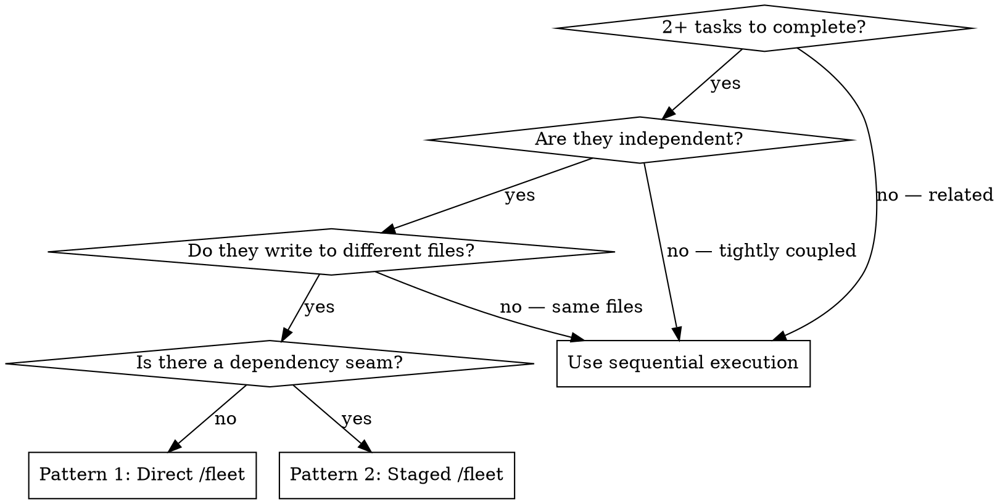

# Dispatching Parallel Agents

## Overview

You dispatch independent tasks to fleet agents running in parallel. Each agent has its own context window and works concurrently. The main agent reviews and integrates results.

**In Copilot CLI: use `/fleet` as the dispatch primitive.** Prefix your prompt with `/fleet` and describe each agent's task in a single message.

**Core principle:** One problem domain per agent. No shared state. Let them work concurrently.

## When to Use



**Use when:**
- 2+ test files failing with different root causes
- Multiple subsystems broken independently
- Research and exploration across unrelated domains
- Each problem can be understood without context from others
- No shared state between tasks (different files, different concerns)

**Don't use when:**
- Tasks write to the same files (agents would conflict)
- You need to see one result before knowing the next task
- Tasks are related (fixing one might fix others)
- Fewer than 2 independent domains (sequential is simpler)

## Pattern 1 — Direct `/fleet` Dispatch

Use for 2–4 independent tasks with no dependency between them.

**Syntax:**
```
/fleet [BRIEF DESCRIPTION] — Agent 1: [task 1 with full context]. Agent 2: [task 2 with full context]. Agent 3: [task 3 with full context].
```

**Example:**
```
/fleet Fix 3 failing test files — Agent 1: fix agent-tool-abort.test.ts — 3 timing/race condition failures, see error output: [paste errors]. Agent 2: fix batch-completion.test.ts — 2 failures, event structure mismatch, see: [paste errors]. Agent 3: fix race-conditions.test.ts — 1 failure, async wait missing, see: [paste errors].
```

Each agent works in its own context window. After all complete:
1. Read each agent's summary
2. Check for conflicts (did any agents edit the same files?)
3. Run the full test suite / verify combined output
4. Integrate any cross-agent concerns

## Pattern 2 — Staged `/fleet` with Handoff

Use when tasks form two waves: an independent first set whose outputs feed a second set.

**Example — research then implement:**
```
Stage 1:
/fleet Research two subsystems — Agent 1: research how the auth system works in src/auth/. Return key findings. Agent 2: research how the session system works in src/sessions/. Return key findings.

[Wait for Stage 1 results]

Stage 2:
/fleet Implement changes using Stage 1 findings — Agent 1: add JWT refresh to auth/ using these findings: [paste Agent 1 findings]. Agent 2: add session invalidation to sessions/ using: [paste Agent 2 findings].
```

The key: Stage 2 prompt includes the actual output from Stage 1. Do not start Stage 2 until all Stage 1 agents have returned.

## Writing Good Agent Prompts

Each agent in a `/fleet` call needs:
1. **Specific scope** — one test file, one subsystem, one concern
2. **Full context** — paste error messages, relevant code snippets, and task description directly
3. **Clear constraints** — "Do NOT change files outside src/auth/"
4. **Expected output format** — "Return: root cause, files changed, any concerns"

**❌ Bad (too vague):**
```
/fleet Fix all the tests — Agent 1: fix auth tests. Agent 2: fix session tests.
```

**✅ Good (specific with context):**
```
/fleet Fix 2 test files — Agent 1: fix src/auth/auth.test.ts — 2 failures: "token not refreshed" (line 45) and "session not invalidated" (line 89). Do NOT change production code. Return: root cause and what you changed. Agent 2: fix src/sessions/session.test.ts — 1 failure: "session.get() returns null after login" (line 23). Suspect src/sessions/store.ts:67. Return: root cause and fix.
```

## After Fleet Agents Return

1. **Read each summary** — understand what changed and what was found
2. **Check for conflicts** — did any agents touch the same files?
3. **Verify integration** — run the full test suite or verify combined output
4. **Spot-check critical changes** — review high-risk changes directly

## Common Mistakes

**❌ Shared state:** Agent 1 edits `config.ts` and Agent 2 also edits `config.ts` → conflict  
**✅ Isolate:** Break into sequential tasks if they share files

**❌ No context:** "Fix the race condition" → agent doesn't know where  
**✅ Context:** Paste the error, the test name, the file path

**❌ Vague output:** "Fix it" → you don't know what changed  
**✅ Specific:** "Return: root cause, files changed, what you fixed"

**❌ Dependent tasks in one fleet call:** Agent 2 needs Agent 1's output  
**✅ Staged:** Use Pattern 2 — wait for Stage 1 before dispatching Stage 2

## Real Example

**Scenario:** 6 test failures across 3 files after a major refactoring

**Fleet call:**
```
/fleet Fix 3 test files — Agent 1: fix agent-tool-abort.test.ts (3 timing failures, errors: [paste]). Agent 2: fix batch-completion-behavior.test.ts (2 failures, event structure errors: [paste]). Agent 3: fix tool-approval-race-conditions.test.ts (1 failure, async count: [paste]).
```

**Results:**
- Agent 1: Replaced timeouts with event-based waiting
- Agent 2: Fixed event structure bug (threadId in wrong location)
- Agent 3: Added wait for async tool execution to complete

**Integration:** All fixes independent, no conflicts, full suite green
